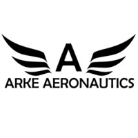
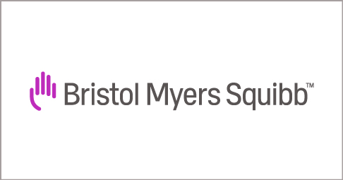

# 👨‍💻 Relevant Experience

 

&nbsp;&nbsp;&nbsp;&nbsp;&nbsp;

**Associate Software Engineer** @ [Innovative Defense Technologies](https://idtus.com/)
Mount Laurel, New Jersey

📅 _December 2021 - Present_

-   Working on various government funded and commercial projects.
-   TODO: Update with some projects I've worked on

&nbsp;

&nbsp;&nbsp;&nbsp;&nbsp;&nbsp;

**Mobile App Developer** @ [Arke Aeronautics](https://www.arkelive.com/)
Glassboro, New Jersey

📅 _October 2020 - June 2021_

-   Built on a cross-platform iOS/Android mobile app to connect first responders to enhanced situational awareness via their cell phones and tablets before arriving and while on-scene.
-   Prototyped and developed majority of the front end using React Native while ensuring compatibility across mobile platforms.
-   Performed extensive testing and debugged code during development and production.
-   Optimized the project and submitted review applications to launch "ArkeMobile" on the iOS App Store and Android Play Store.

&nbsp;

&nbsp;&nbsp;&nbsp;&nbsp;&nbsp;

**Full Stack Intern** @ [FuturFits](https://chrome.google.com/webstore/detail/futurfits/lbijjbmhbdcmgohdcppmpgamaopncbig)
Glassboro, New Jersey

📅 _June 2020 - September 2020_

-   Developed a Web Application and Chrome Extension that allows users to save their favorite products during e-commerce shopping.
-   Modeled the application database and built a RESTful API using MongoDB and Express.js.
-   Designed and implemented parts of the Chrome Extension user interface using React.js

&nbsp;

# Other Experience

 

&nbsp;&nbsp;&nbsp;&nbsp;&nbsp;

**Undergraduate Research Assistant** @ [Bristol Myers Squibb](https://csm.rowan.edu/departments/cs/research/bms/)
Glassboro, New Jersey

📅 _July 2019 - January 2020_

-   Collaborated with BMS to research efficient ways of visualizing, pre-processing, and downsampling very large metabolomics data, specifically liquid chromatography - mass spectrometry.
